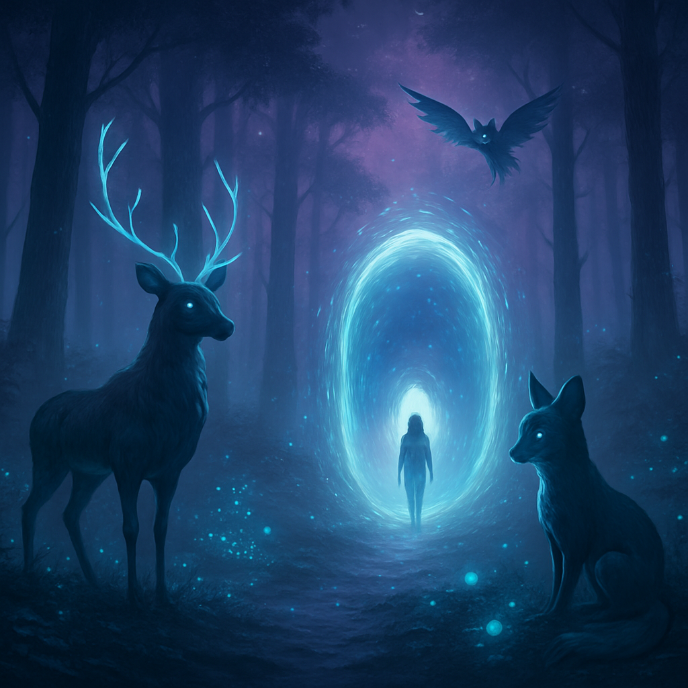

# 🌙 DreamChoice AI

**DreamChoice AI** is a choose-your-own-adventure game where your decisions shape a surreal dream world — powered by ChatGPT.

Built as a final project for Stanford's 🔗[**Code in Place 2025**](https://codeinplace.stanford.edu/).

---

## 🧠 About the Project

You, the dream traveler, shape the journey by making decisions that guide the narrative forward. Every story is different — and uniquely yours.

DreamChoice AI lets you:

- 🎭 Enter your name and embark on a dream journey
- 🤖 Get dynamic story segments generated by OpenAI’s GPT
- 🔮 Make choices (A/B) that change the outcome
- 🌌 Experience a different dream every time

---

## 🛠 Tech Stack

- Python 3
- OpenAI API (`gpt-3.5-turbo`)
- GitHub Codespaces

---

## 🚀 Run the Project

### 1. Clone the Repo

```bash
git clone https://github.com/YOUR_USERNAME/dreamchoice-ai.git
cd dreamchoice-ai
```

### 2. Install dependencies

```bash
pip install -r requirements.txt
```

If requirements.txt is missing, create one with:

```bash
openai
```

### 3. Add your API key

Create a file called **config.py** (DO NOT commit this file), and add your OpenAI key like so:

```bash
OPENAI_API_KEY = "your-openai-api-key"
```

You can also copy from the template:

```bash
cp config_example.py config.py
```

Then paste in your real key.

### 4. Run the app

```bash
python main.py
```

Follow the prompts and enjoy the story 🌌

___

## 📁 File Structure

```bash
dreamchoice-ai/
│
├── main.py              # Entry point
├── ai_engine.py         # Handles OpenAI API calls
├── story.py             # Story control and logic
├── config_example.py    # Template config (no key)
├── README.md            # You're reading it!
```

---

## 📸 Thumbnail


Description: an image generated by Dall-E on a dark, dreamy sci-fi forest with mystical creatures. Visual credit goes to OpenAI 🎨🌈.

---

## 🎮 Video Demo

[](https://www.youtube.com/watch?v=WsckRhFKp54)

> *(Click thumbnail to watch on YouTube)*
___

## 🧠 Credits

Created as part of **Code in Place 2025**  
Dreamed up and coded by @dunktra ✨  
Powered by OpenAI's GPT API.

Interested in joing Code in Place? Go here 👉[click me!!](https://codeinplace.stanford.edu/)
